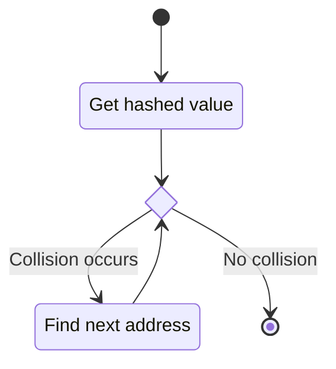
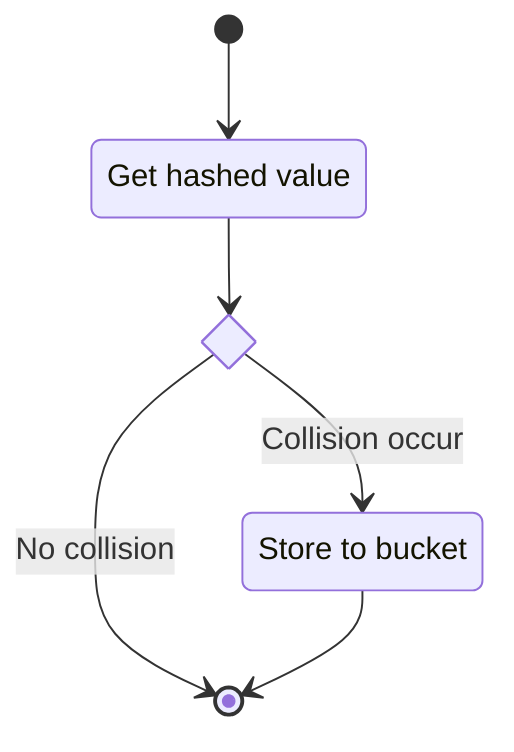

# Concept

### General Hash Map
> How should it looks like?

- Number of buckets is `M`
- Number of entries is `n`
- Load factor `A = n / M ≤ 1`

### Hash function
> Generate addresses for keys

`Address relates to h(key)`
- Domain (key) and Range (code) of `h` is defined
- Hashed values are uniformly distributed
	- Use every imformation in any key
	- Less memory waste
- Less collision

###### Schemes
- Hashing by division
	- `h(key) = key % M`
	- If `M` approaches power of two, more collisions will occur.
- Hashing by multiplication
	- `C` is a constant that `0 < C < 1`
	- `h(key) = M * (C * key - ⌊C * key⌋)`

### Collision resolution
> Handle collision, since they are unavoidable

###### Schemes
- Closed Hashing / Open Addressing
	- Closed - All entries are stored in one array of buckets
	- Open - Address partically depends on the other buckets
	- `h(k, i) = p(h(k, i-1))`, `i` is times of probing, `p` is probing function
	- Cost skyrockets when the Load factor `A` approaches `1`
	- Probing state diagram:

- Open Hashing / Closed Addressing / Seperate Chaining
	- Open - Not all entries are stored in one array of buckets
	- Closed - Address totally depends on the key
	- Less sensitive to the Load factor `A`
	- Use buckets to store collided keys
	- State diagram:

----
[Go to previous - Abstract](./Abstract.md)
[Go to next - Decision](./Decision.md)
[Return home - README](./README.md)