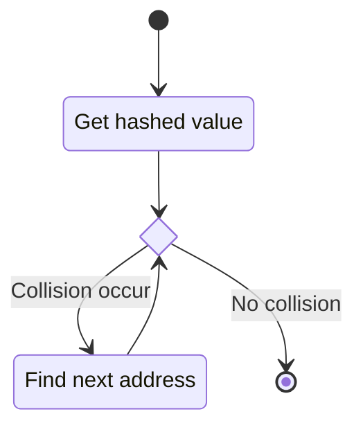
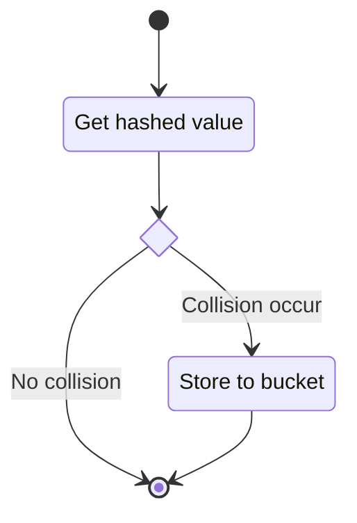

# Concepts

### General Hash Map
> How should it looks like?

- Has an buffer with certain size `M`
- Records entries (keys and values), number of entries is `N`
- Load factor `A = N / M ≤ 1`

### Hash function
> Generate good indices for keys

`Index relates to h(key)`
- Domain (key) and Range (code) of h is defined
- Hashed values are uniformly distributed
	- Use every imformation in any key
	- Less memory waste
	- Less collision

**Schemes**
- Hashing by division
	- `h(key) = key mod M`
	- If M approaches power of two, more collisions will occur.
- Hashing by multiplication
	- C is a constant that 0 < C < 1
	- `h(key) = M * (C * key - ⌊C * key⌋)`

### Collision resolution
> Handle collision, since they are unavoidable

**Schemes**
- Closed Hashing / Open Addressing
	- Closed - All entries are stored in one buffer
	- Open - Address partically depends on the former keys
	- `h(k, i) = f(h(k, i-1))`, i is times of probing, f is probing function
	- Cost skyrockets when the Load factor `A` approaches 1
	- Probing state diagram:

- Open Hashing / Seperate Chaining
	- Open - Not all entries are stored in one buffer
	- Less sensitive to the Load factor `A`
	- Use buckets to store collided keys
	- State diagram:

