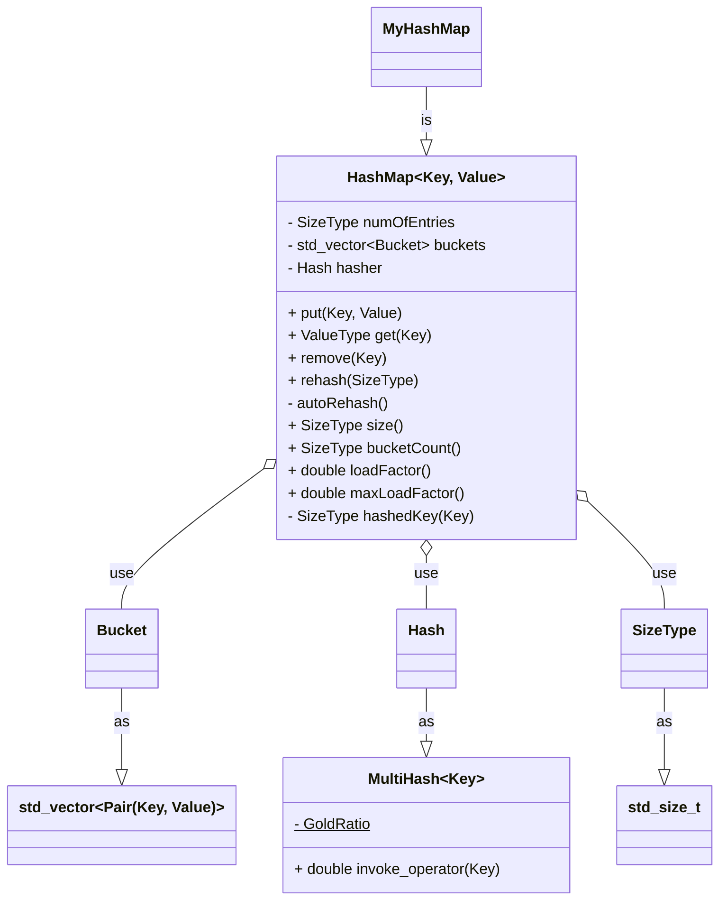

# Logic

### Outline Of Structure
|Key|->|Entry| | | | | |
|-|-|-|-|-|-|-|-|
|2|–>|(2,v)| | | | | |
|7|–>|(7,v)| | | | | |
|3|–>|(3,v)|(11,v)| | | | |
| |–>| | | | | | |
|9|–>|(1,v)|(10,v)|(12,v)|(15,v)|(31,v)|(24,v)|
|5|–>|(21,v)| | | | | |
| |–>| | | | | | |
|4|–>|(52,v)|(54,v)|(55,v)| | | |

### Refactor
- Number of buckets is `M`
	- `bucketCount()`
- Number of entries is `n`
	- `numOfEntries, size()`
- Load factor `A = n / M ≤ 1` 
	- `loadFactor() = size() / bucketCount() <= maxLoadFactor()`
	- when `loadFactor()` passes `maxLoadFactor()`, do rehashing

### Functionality design

### Flow chart
> TODO

----
[Return README](./README.md)