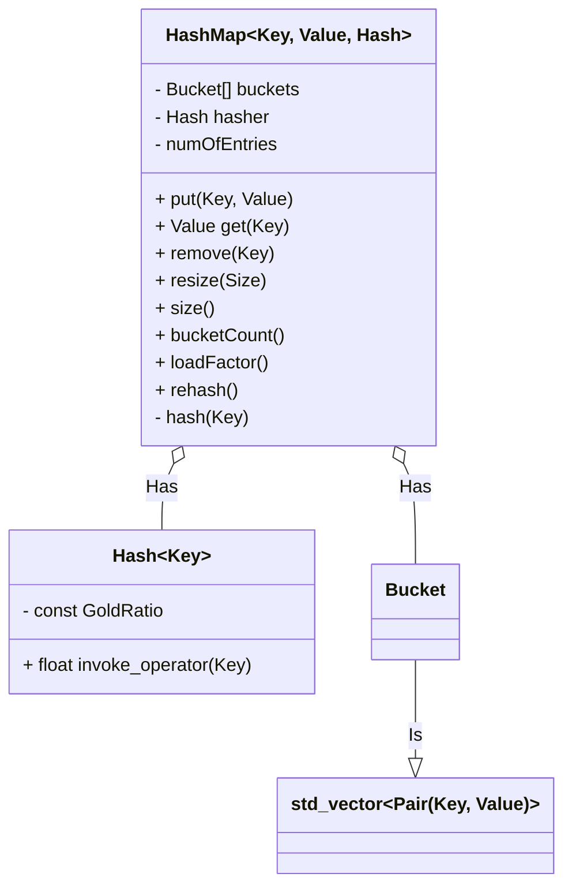

# Logic

### Outline Of Structure
|Key|->|Entry|
|-|-|-|-|-|-|-|-|
|2|–>|(2,v)|
|7|–>|(7,v)|
|3|–>|(3,v)|(11,v)|
| |–>|
|9|–>|(1,v)|(10,v)|(12,v)|(15,v)|(31,v)|(24,v)|
|5|–>|(21,v)|
| |–>|
|4|–>|(52,v)|(54,v)|(55,v)|

- Number of buckets is `M`
- Number of entries is `n`

### Functionality design

### Flow chart
> TODO